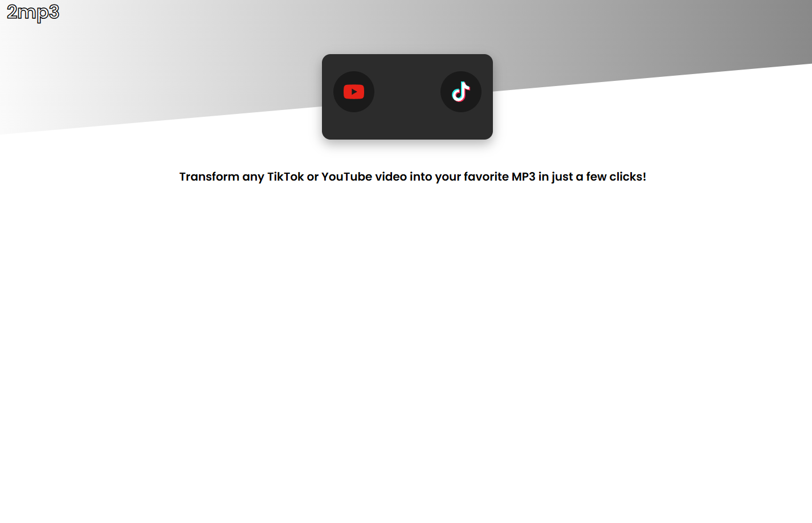
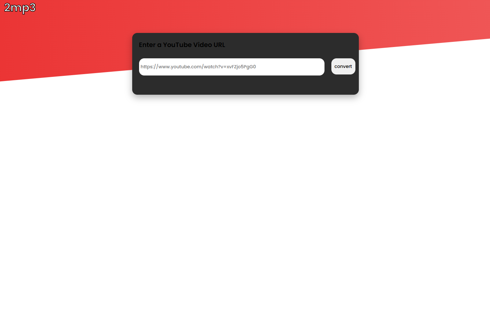
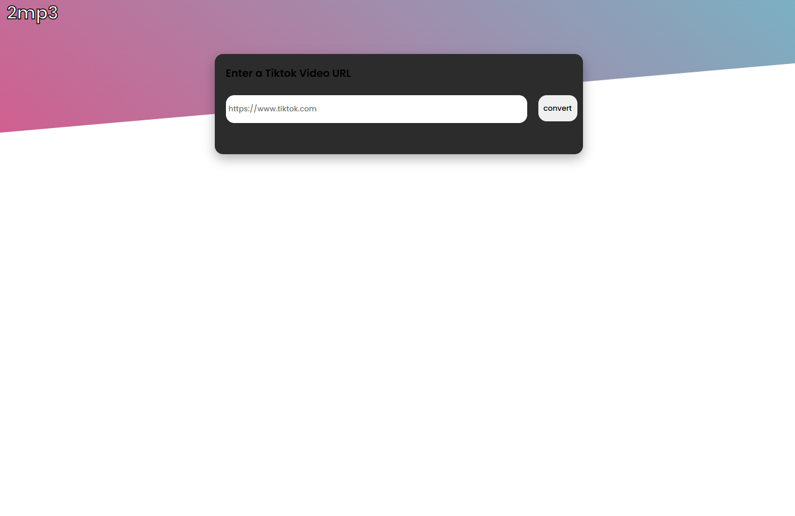

# 🎵 2MP3 Converter

A simple and clean web app that converts YouTube and TikTok video links into downloadable MP3 files. Built with HTML, CSS, and JavaScript for the frontend and powered by a Node.js + Express backend using yt-dlp and ffmpeg for processing. Hosted on Railway with frontend live on GitHub Pages.


--- 

## 🔗 Live Demo
[View on GitHub Pages](https://gavinnewin.github.io/2mp3/)

---

## 🚀 Features

- Convert YouTube or TikTok videos to MP3
- Supports both youtube.com and youtu.be URLs
- Backend processes download and sends file
- Clean design with instant feedback

---

## 🛠️ Tech Stack

- **Frontend:** HTML, CSS, JavaScript
- **Backend:** Node.js, Express
- **Tools:** yt-dlp, ffmpeg
- **Hosting:** Railway (backend), GitHub Pages (frontend)

---

## 📦 Installation

```bash
# Clone the repo
git clone https://github.com/gavinnewin/2mp3.git
cd 2mp3

# Install dependencies
npm install

# Run the server locally
node server.js

```

## 📷 Screenshots

### Homepage


### YouTube Conversion


### TikTok Conversion

